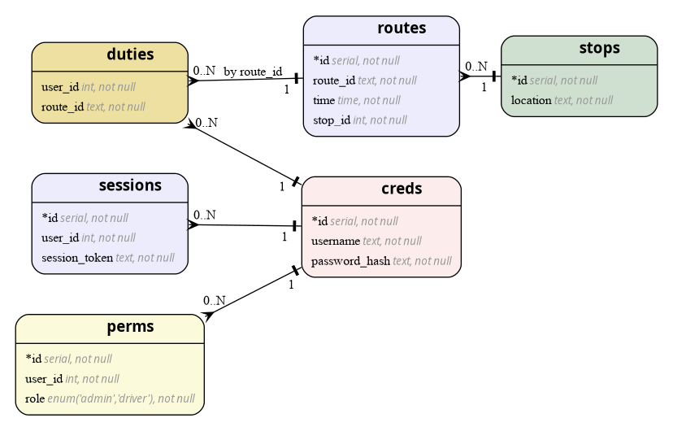

# Fleet Manager 🚌

Table of contents:

- [Building](#building)
- [Running](#running)
- [Documentation](#documentation)
    - [`\App\Controllers`](#appcontrollers)
    - [`\App\Database`](#appdatabase)
    - [`\App\Http`](#apphttp)
    - [`\App\Routing`](#approuting)
- [Security](#security)
    - [Content Security Policy](#content-security-policy)
    - [No Cookies](#no-cookies)
    - [No untrusted inputs](#no-untrusted-inputs)
- [ERD](#erd)


## Building

Using Docker:

```
docker buildx build -f Dockerfile -t fleetmanager
```

Using Podman:

```
podman build -f Dockerfile -t fleetmanager
```

## Running

Using Docker:

```
docker run -p 8080:8080 fleetmanager
```

Using Podman:

```
podman run -p 8080:8080 localhost/fleetmanager
```

## Documentation

### `\App\Controllers`

#### Classes

| Class                                                                      |
|----------------------------------------------------------------------------|
| [`LineController`](./server/docs/classes/App/Controllers/LineController.md)               |
| [`RouteController`](./server/docs/classes/App/Controllers/RouteController.md)             |
| [`SessionController`](./server/docs/classes/App/Controllers/SessionController.md)         |
| [`StopController`](./server/docs/classes/App/Controllers/StopController.md)               |
| [`UserManagerController`](./server/docs/classes/App/Controllers/UserManagerController.md) |

### `\App\Database`

#### Classes

| Class                                             |
|---------------------------------------------------|
| [`Connection`](./server/docs/classes/App/Database/Connection.md) |

### `\App\Http`

#### Classes

| Class                                                     |
|-----------------------------------------------------------|
| [`Csp`](./server/docs/classes/App/Http/Csp.md)                           |
| [`StaticFileServer`](./server/docs/classes/App/Http/StaticFileServer.md) |

### `\App\Routing`

#### Classes

| Class                                                    |
|----------------------------------------------------------|
| [`RouteRegistrar`](./server/docs/classes/App/Routing/RouteRegistrar.md) |

## Security

### Content Security Policy

To prevent XSS and related attacks, the application employs a semi-strict CSP policy. To ease the maintenance burden, hashes are used instead of the typical CSP nounces.

Upon startup, the backend calculates the check sums of allowed scripts and instructs the user's browser to permit execution. Scripts that are not explicitly allowed are blocked by the browser. SHA256 was chosen for a balanced mix of performance and security. Related documentation can be found [`here`](./server/docs/classes/App/Http/Csp.md).

### No Cookies

Cookies are often used to gain unauthorized access to various critical systems and can allow adversaries to perform malicious actions on behalf of a legitimate user (so called "Session Hijack").

To make such attackers' life a bit harder, the application uses the `localStorage` API instead of traditional cookies. This reduces the attack surface and eliminates a whole category of automated penetration testing techniques that rely on cookie theft.

### No untrusted inputs

The backend never injects untrusted data into raw PHP templates. All user-supplied input is either ignored, validated, or passed through structured APIs. By design, no server-side rendering of untrusted values occurs, which prevents injection vulnerabilities such as template injection, or broken HTML output.

## ERD


